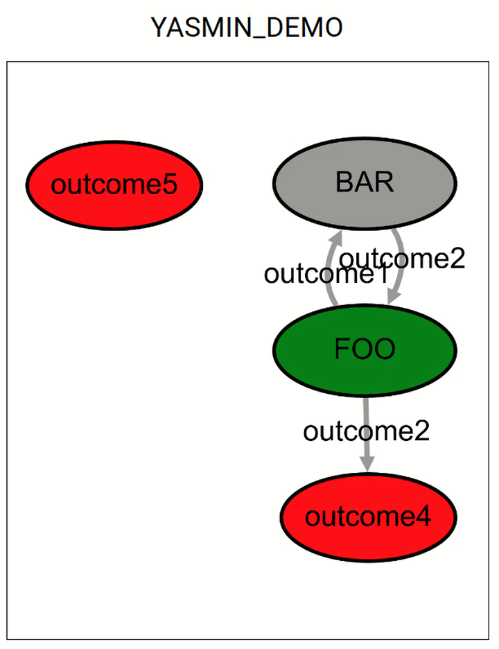

# YASMIN (Yet Another State MachINe)

YASMIN is a project focused on implementing robot behaviors using Finite State Machines (FSM). It is available for ROS 2, Python and C++.

## Table of Contents

1. [Features](#features)
2. [Installation](#installation)
3. [Demos](#demos)
   - [Python](#python)
   - [Cpp](#cpp)
4. [YASMIN Viewer](#yasmin-viewer)

## Features

- Fully integrated into ROS 2.
- Available for Python and C++.
- Fast prototyping.
- Default states for ROS 2 action and service clients.
- Blackboards are used to share data between states and state machines.
- State machines can be canceled and stopped, which means stopping the current executing state.
- A web viewer is included, which allows monitoring of the execution of the state machines.

## Installation

```shell
$ cd ~/ros2_ws/src
$ git clone git@github.com:uleroboticsgroup/simple_node.git
$ git clone git@github.com:uleroboticsgroup/yasmin.git
$ cd yasmin
$ pip3 install -r requirements.txt
$ cd ~/ros2_ws
$ colcon build
```

## Demos

A Python and a C++ demo are included.

<p align="center">
  
</p>

### Python

```python
#!/usr/bin/env python3

import time
import rclpy

from simple_node import Node

from yasmin import State
from yasmin import StateMachine
from yasmin_viewer import YasminViewerPub


# define state Foo
class FooState(State):
    def __init__(self):
        super().__init__(["outcome1", "outcome2"])
        self.counter = 0

    def execute(self, blackboard):
        print("Executing state FOO")
        time.sleep(3)

        if self.counter < 3:
            self.counter += 1
            blackboard.foo_str = "Counter: " + str(self.counter)
            return "outcome1"
        else:
            return "outcome2"


# define state Bar
class BarState(State):
    def __init__(self):
        super().__init__(outcomes=["outcome2"])

    def execute(self, blackboard):
        print("Executing state BAR")
        time.sleep(3)

        print(blackboard.foo_str)
        return "outcome2"


class DemoNode(Node):

    def __init__(self):
        super().__init__("yasmin_node")

        # create a state machine
        sm = StateMachine(outcomes=["outcome4", "outcome5"])

        # add states
        sm.add_state("FOO", FooState(),
                     transitions={"outcome1": "BAR",
                                  "outcome2": "outcome4"})
        sm.add_state("BAR", BarState(),
                     transitions={"outcome2": "FOO"})

        # pub
        YasminViewerPub(self, "YASMIN_DEMO", sm)

        # execute
        outcome = sm()
        print(outcome)


# main
def main(args=None):

    print("yasmin_demo")
    rclpy.init(args=args)
    node = DemoNode()
    node.join_spin()
    rclpy.shutdown()


if __name__ == "__main__":
    main()
```

### Cpp

```cpp

#include <chrono>
#include <iostream>
#include <memory>
#include <string>

#include "simple_node/node.hpp"

#include "yasmin/state.hpp"
#include "yasmin/state_machine.hpp"
#include "yasmin_viewer/yasmin_viewer_pub.hpp"

// define state Foo
class FooState : public yasmin::State {
public:
  int counter;

  FooState() : yasmin::State({"outcome1", "outcome2"}) { this->counter = 0; };

  std::string
  execute(std::shared_ptr<yasmin::blackboard::Blackboard> blackboard) {
    std::cout << "Executing state FOO\n";
    std::this_thread::sleep_for(std::chrono::seconds(3));

    if (this->counter < 3) {
      this->counter += 1;
      blackboard->set<std::string>("foo_str",
                                   "Counter: " + std::to_string(this->counter));
      return "outcome1";

    } else {
      return "outcome2";
    }
  }

  std::string to_string() { return "FooState"; }
};

// define state Bar
class BarState : public yasmin::State {
public:
  BarState() : yasmin::State({"outcome2"}){};

  std::string
  execute(std::shared_ptr<yasmin::blackboard::Blackboard> blackboard) {
    std::cout << "Executing state BAR\n";
    std::this_thread::sleep_for(std::chrono::seconds(3));

    std::cout << blackboard->get<std::string>("foo_str") << "\n";

    return "outcome2";
  }

  std::string to_string() { return "BarState"; }
};

class DemoNode : public simple_node::Node {
public:
  std::unique_ptr<yasmin_viewer::YasminViewerPub> yamin_pub;

  DemoNode() : simple_node::Node("yasmin_node") {

    // create a state machine
    auto sm = std::make_shared<yasmin::StateMachine>(
        yasmin::StateMachine({"outcome4", "outcome5"}));

    // add states
    sm->add_state("FOO", std::make_shared<FooState>(),
                  {{"outcome1", "BAR"}, {"outcome2", "outcome4"}});
    sm->add_state("BAR", std::make_shared<BarState>(), {{"outcome2", "FOO"}});

    // pub
    this->yamin_pub = std::make_unique<yasmin_viewer::YasminViewerPub>(
        yasmin_viewer::YasminViewerPub(this, "YASMIN_DEMO", sm));

    // execute
    std::string outcome = (*sm.get())();
    std::cout << outcome << "\n";
  }
};

int main(int argc, char *argv[]) {

  std::cout << "yasmin_demo\n";
  rclcpp::init(argc, argv);
  auto node = std::make_shared<DemoNode>();
  node->join_spin();
  rclcpp::shutdown();

  return 0;
}
```

<a name="#YASMIN-Viewer"></a>

## YASMIN Viewer

This viewer allows monitoring YASMIN's FSM. It is implemented with Flask and ReactJS. A filter is provided to show only one FSM.


### Usage

```shell
$ ros2 run yasmin_viewer yasmin_viewer_node
```

http://localhost:5000/
